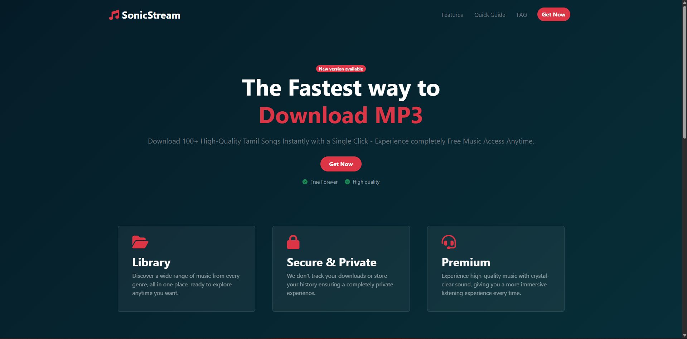
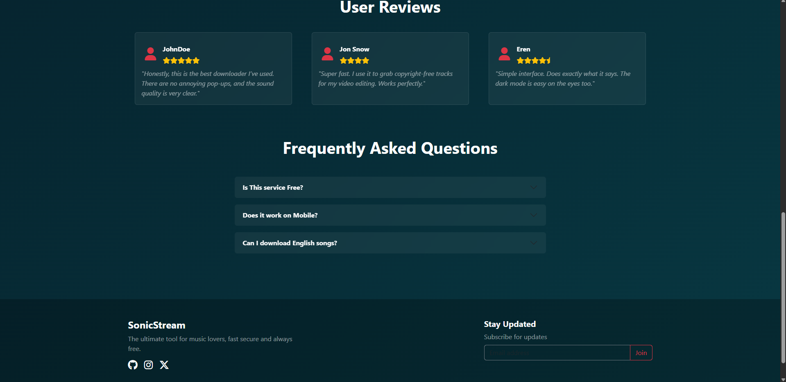

# MP3 Downloader Landing Page

Internship Project – Cyberdude Networks

## Overview

This project was developed during my internship at Cyberdude Networks. It is a fully responsive landing page for an MP3 Downloader, designed using Bootstrap and built with clean and minimal UI principles.

## Features

- Fully responsive design using Bootstrap
- Clean and minimal landing page layout
- Feature highlights and simple navigation
- Fast-loading structure
- Designed based on Figma wireframe

## Technologies Used

- HTML5
- CSS3
- Bootstrap 5
- Figma

## Live Demo

**Live Link:**  
[SonicStream(Click here)](https://santhosh-006.github.io/SonicStream-cyberdude/)

## Figma Design

**Figma Link:**

## Screenshots

### Landing Page Preview

